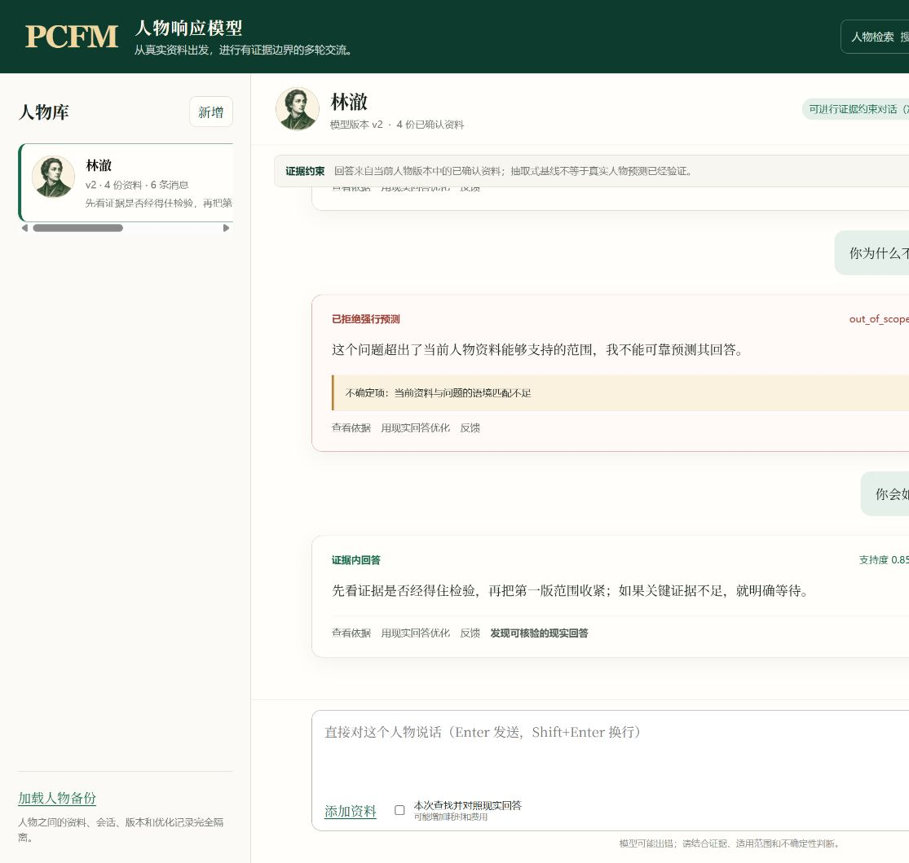
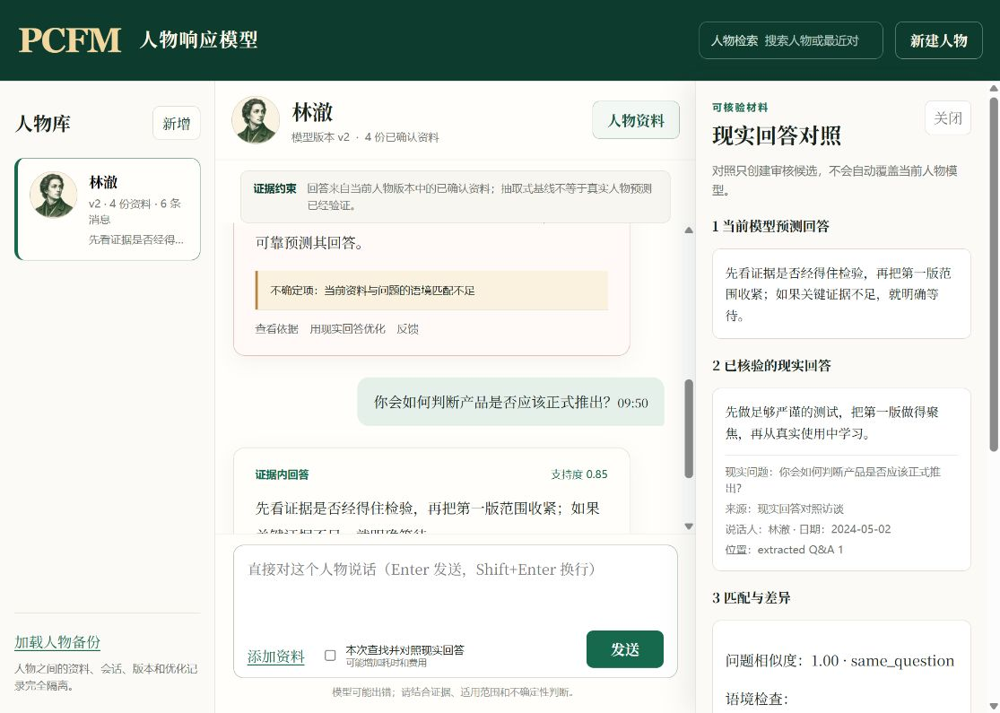

# PCFM 人物对话系统


**证据约束的人物对话模拟 MVP · 会话条件响应版**

PCFM（Person-Conditioned Factual Memory）是一个可证伪的人物对话模拟研究原型：它用**可逐字溯源的本人公开材料**建立人物模型，在对话中优先给出**该人物真实说过的话**，只在证据充分时用人物自身的重复取向做条件性推断，并在证据不足、超出领域或时间不可复核时拒绝输出。它模拟的是人物**可观测的对外表现**，不宣称恢复真实内心，也不把生成内容冒充为人物记忆。

> 当前发布版 v0.11.0 内置 5 个初始人物：**Steve Jobs（乔布斯）、Donald Trump（特朗普）、Warren Buffett（巴菲特）、王阳明、鲁迅**。

## 目录

- [与普通角色扮演的区别](#与普通角色扮演的区别)
- [核心原则（不可妥协）](#核心原则不可妥协)
- [快速开始](#快速开始)
- [界面预览](#界面预览)
- [对话机制](#对话机制)
- [主流程](#主流程)
- [命令行](#命令行)
- [测试与验证](#测试与验证)
- [已知边界](#已知边界)
- [版本兼容性](#版本兼容性)
- [历史与研究候选](#历史与研究候选)
- [文档索引](#文档索引)

---

## 与普通角色扮演的区别

| 维度 | 普通 LLM 角色扮演 | PCFM |
|---|---|---|
| 人物知识来源 | 模型参数中的模糊印象 | **可逐字溯源的本人公开材料** |
| 回答优先策略 | 模型自由生成 | **确定性证据优先**，原话逐字返回 |
| 立场决定者 | LLM | **代码门禁**，LLM 只出候选 |
| 证据不足时 | 编造一个"像"的回答 | **拒绝输出**或明确标注通用协助 |
| 内容与风格 | 混合生成，风格层可改观点 | **严格分离**，风格层不能改立场/事实/数字 |
| 可证伪性 | 无法追溯回答依据 | 每条回答可查看规划、证据引用与验证调用 |
| 准确性声明 | 常暗示"还原人物" | 明确标注 `not_assessed`，不宣称恢复内心 |

---

## 核心原则（不可妥协）

1. **原子是计算核心，不是检索索引。** 事件原子（触发窗口、逐字回应片段、时间、对象、场合、已知信息、缺失字段）保留可追溯的证据谱系，多个独立来源谱系的伴随原子才形成可复用的公开取向。
2. **LLM 只出候选，代码做验证/门禁/最终选择。** 大模型永远不能提交人物立场字段，不能把生成对话变成人物证据。内容计划冻结后，模型才可补充通用知识并组织自然回答，最后进入独立的纯表面风格层。
3. **内容与风格分离。** 立场、事实、否定、模态词、数字、日期、引语和置信度在内容层锁定，风格层只能改措辞/语气/语言，不能改变内容。

### 证据硬门槛

只有**可追溯的逐字稿**（本人公开、能逐字溯源），或**能对应原文位置的准确翻译**，才可能成为人物回答的训练标签。编辑摘要、模型生成内容、搜索摘要和第三方转述只能保留为**参考或待核验候选**，不能训练。

多人材料不会整份自动归因，必须逐条确认说话人与逐字位置。

---

## 快速开始

```bash
# 安装 Python 依赖
pip install -e .
```

启动本地网页：

```powershell
python -m pcfm.webapp --data-dir <你的数据目录>
# 或 Windows 双击 启动PCFM人物对话系统.bat
```

默认地址：`http://127.0.0.1:8765`

> 模型服务（如 DeepSeek）需先在页面「＋添加供应商」配置并**通过一次真实结构化调用验证**后才可选。保存配置不会自动调用；读取模型列表也不等于可用。

### 内置初始人物

| 人物 | 材料类型 | 说明 |
|---|---|---|
| Steve Jobs | 斯坦福毕业演讲（英文逐字） | 2005 Stanford Commencement Address |
| Donald Trump | 就职/国情咨文/国会演讲（英文逐字） | 2017–2020 公开演讲 |
| Warren Buffett | 致股东信（英文逐字） | 2023、2024 年度信 |
| 王阳明 | 大学问/亲笔书信/诗歌（中文逐字） | 本人著作 |
| 鲁迅 | 杂文/散文/书信（中文逐字） | 本人原文 |

> 这些是基于逐字材料的探索性模型，**不是**准确率或人格恢复证明。人物材料、事件原子与模型可在网页中查看、回退或归档。

---

## 界面预览

**对话主界面** — 左侧人物列表，中间对话区，回答附带依据入口：



**依据抽屉** — 每条回答可展开查看本次规划、证据引用与验证调用次数：



---

## 对话机制

对话输入不只处理最新一句。系统从原始消息重建话题线程、当前话题、被引用消息、人物此前的对话承诺、关系、场合和时间范围，把当前消息作为状态增量。

调用顺序为**"确定性证据优先，语义模型补足"**：

1. 历史问题相同或近乎相同 → 返回**直接公开回答**（该人物原话，逐字，不调用模型）。
2. 复合问题 → 展示多个相关历史事件，但不伪装成新立场。
3. 新问题 → 由所选模型提出受限的情境—价值影响映射，代码用人物的重复公开取向、角色、领域、时间和反证门禁决定方向。
4. 无可用的确定性人物路线、存在歧义或需外部知识时，才调用语义模型补充通用知识并组织回答。

每条回答可在页面「查看依据」中看到本次规划、内容补充与验证调用次数。

---

## 主流程

创建人物（系统搜索或自行提供资料）→ 系统从原始材料整理事件候选 → 审核原文真实性、位置和说话人 → 直接多轮交流 → 按需查找相近的现实回答 → 用户选择一条现实事件进入优化候选 → 通过角色隔离和留出非退化门禁后生成探索性新版本 → 查看或回退版本 → 归档、恢复或名称确认后永久删除。

支持的资料格式：粘贴文本、TXT、Markdown、HTML、PDF、SRT/VTT、JSON、CSV、网页地址。公开资料搜索（Bing RSS）结果只能成为待核验候选。

---

## 命令行

拟合稳定模型：

```powershell
python -m pcfm fit `
  --input <training-ledger.jsonl> `
  --applicability-ledger <applicability-ledger.jsonl> `
  --validation-ledger <validation-ledger.jsonl> `
  --verification-keys <verification-keys.json> `
  --person-id <person-id> `
  --feature-names reward,risk,control `
  --output <person-model.json>
```

研究性质的功能（主动实验、机制比较、复合模型、动态状态、前瞻试点）请通过 `python -m pcfm --help` 查看；它们保留为研究候选，不进入人物对话主路径。

---

## 测试与验证

```powershell
$env:PYTHONPATH = "$PWD\src"
python -m unittest discover -s tests -v
```

当前全量回归：**268 项通过**（含对话模拟、证据合同、领域画像、叙述门禁、渲染层、SQLite 同步等）。

> 软件回归通过不等于现实人物预测准确性已验证。准确性验收必须使用按时间和来源谱系隔离的完整多轮对话留出集，并与错误人物、打乱历史、纯检索和通用模型基线比较；在该类数据建立前，结果固定为 `not_assessed_full_conversation_holdout_required`。

---

## 已知边界

### 人物对话系统

配置并验证一个大语言模型后，人物对话即可正常工作（确定性证据优先，证据不足时由模型作明确标注的推导/通用协助）。系统的边界在于**证据与诚实**，而非可用性：

- 模拟的是人物**可观测的对外表现**，不宣称恢复真实内心、思想或记忆。
- 只基于**可逐字溯源的本人公开材料**；材料未覆盖的领域会拒绝输出，或作明确标注的通用协助（不会冒充人物原话）。
- 人物预测准确性尚未用独立多轮留出集验证，状态固定为 `not_assessed_full_conversation_holdout_required`。
- 确定性证据优先：新情境推导基于人物**重复的公开取向**，不是内心真实；模型生成内容不是人物证据。
- 检索按语言匹配（中文材料/中文提问、英文材料/英文提问）；跨语言问题走通用推导路径。

### 研究模块（非对话主路径）

以下限制属于研究性质的功能（主动实验、机制比较、复合模型、动态状态），与人物对话系统无关：

- 只支持固定数值特征下的结构化二元选择；一维残差不能表达多维记忆、信念、目标或价值状态。
- 无外部状态测量或随机干预时，残差原因在统计上不可识别。
- 主动规划器只能降低已有线性人物参数的不确定性，不能发现候选模型中没有的信念、价值或因果机制。
- 机制模块只能在预先列出的数学结构中选择；结构项不等同于信念、价值或因果解释。
- 候选题池仍需外部设计者产生。
- 通过全部门禁只说明在定义任务上的可重复预测价值，不说明已经还原人物思想。

---

## 版本兼容性

- 包版本：`0.11.0`
- 模型工件：`pcfm-bundle-v7`
- 动态模块：`continuous-time-logit-state-v2`
- 机制工件：`pcfm-mechanism-plan-v2` / `pcfm-mechanism-report-v2`
- 复合工件：`pcfm-composite-model-v1`
- 动态工件：`pcfm-dynamic-state-plan-v1` / `pcfm-dynamic-state-v2`

旧 bundle、主动实验 v2、动态报告和机制 v1 工件缺少现行合同字段，必须从原始签名账本重新拟合，不做静默升级。

---

## 历史与研究候选

以下内容保留为历史与高级诊断资料，不再是首页主流程：

- **受约束表达渲染层 v1**（`src/pcfm/expression_profiles/steve_jobs_v1/`）：独立的表达渲染闭环，不能独立回答问题。
- **PCFM 人物认知模型工作台 v0.2**：证据约束的窄域人物推演，Logistic 核心降级为"行为基线模型"。
- **研究候选**（均已 `rejected_candidate` 或 `not_supported`，未进入人物对话主路径）：Decision-Context-Rationale Evidence Contract v1、Person-Issue Relational Core v1、Joint Person Core v1、Reality Bridge v1、Support-set HyperNetwork v1、Anisotropic Empirical-Bayes Adapter v1、Person-choice Benchmark v1、Prospective Single-Person Pilot v1。
- **Tyler historical corpus v1**：历史语料汇编层，`implemented_unintegrated`。

详细合同与报告见 [`docs/archive/`](docs/archive/) 下对应 `*_REPORT.md` / `*_CONTRACT.md` 文档。

---

## 文档索引

| 文档 | 说明 |
|---|---|
| [ARCHITECTURE.md](ARCHITECTURE.md) | 架构与改造基准（核心机制、数据模型、运行逻辑） |
| [CHANGELOG.md](CHANGELOG.md) | 版本变更记录 |
| [CONTRIBUTING.md](CONTRIBUTING.md) | 贡献指南 |
| [docs/archive/](docs/archive/) | 历史模块合同、报告与门禁记录 |
